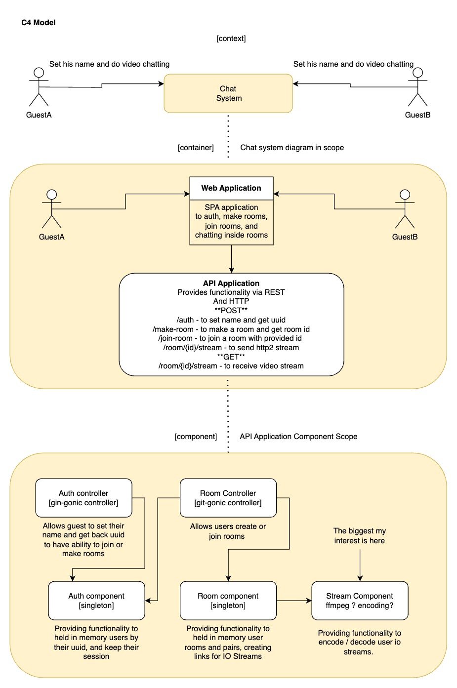

## web-grpc-video-chat

Hello,

This is my personal playground where I want to implement video chat using grpc and server side logic in Go.

My happy path will be like described further.

Happy path:
```
(UserA) => (Browser) => (Video/Audio Capture) => (Go backend service) => (Browser) => (UserB)
```

#### UPD: I faced few issues, with making Vite+ReactTS working with grpcweb, if you are facing same issues and struggling with google pb replace it with protoc-gen-ts;

#### PS: We use Envoy as tls terminator, router and WebGRPC 2 gRPC transport. WebGRPC in browser can work only with TSL, and require CORS, for that I was trying to use NGINX but proxy_pass not support http2 and grps_proxy not support webgrpc. Envoy is one of best choices, you can use webrpc wrappers for Golang, I tried it, but app became too messy for my small application. I recommend use Envoy.

### Original Plan
First what we do is a c4 model, in our case c3, it's very helpful and save a lot of time.




After joining and when users can see and hear each other, the PoC ends.

Main goals is to find out resources needed and do we need opencv or not.

I do this strictly for self-education and a pleasant pastime. I do not give any guarantees,
and you are free to use this code if you suddenly need it. ;)

### Reality (soon)
